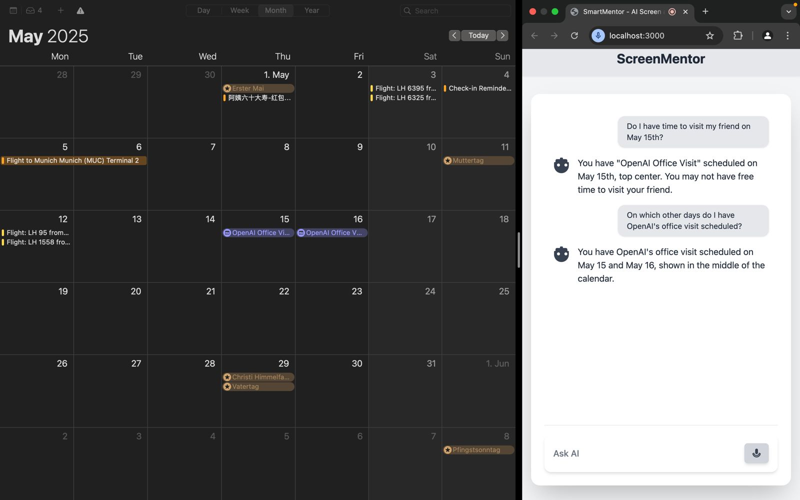

# ScreenMentor - AI Screen and Audio Assistant

An AI-powered application that captures your screen and audio input, processes them through OpenAI's GPT models, and provides real-time intelligent audio responses.  
ScreenMentor features a ChatGPT-like user interface with seamless screen sharing and voice interaction.

## Example Screenshot


---

## Why we care? 

We ourselves constantly felt the friction: every time we had a question, we had to stop, copy-paste, describe what we were seeing, and then piece together an answer. It interrupted our flow.

## 🚀 Features

- Real-time screen capture
- Real-time audio recording and transcription
- Integration with OpenAI's GPT-4.1-mini and GPT-4o-mini models
- Text-to-speech (TTS) generation for AI responses
- ChatGPT-like frontend design
- WebSocket-based real-time communication
- Multi-modal AI assistant combining screen + voice understanding

---

## Project Structure
```
.
├── backend/
│   ├── app/
│   │   ├── api/
│   │   ├── core/
│   │   ├── services/
│   │   └── main.py
├── frontend/
│   ├── public/
│   ├── src/
│   │   ├── components/
│   │   ├── services/
│   │   └── styles/
│   └── package.json
└── requirements.txt
```

## 🛠️ Setup Instructions

1. **Clone the repository:**
   ```bash
   git clone https://github.com/your-username/your-repo-name.git
   cd your-repo-name
   ```
   

2. **Create and activate a virtual environment:**
(We tested using Python 3.12 and recommend using it.)
   ```bash 
   python3 -m venv venv
   source venv/bin/activate
   ```

3. **Install Python dependencies:**
   ```bash
   pip install -r requirements.txt
   ```

4. **Start the backend server:**
   ```bash
   cd backend
   uvicorn app.main:app --reload --host 0.0.0.0 --port 8000
   ```

5. **Install frontend dependencies:**
   ```bash
   cd frontend
   npm install
   ```

6. **Start the frontend development server:**
   ```bash
   npm run dev
   ```

The Server now runs on http://localhost:3000. Share your screen and allow the browser to use your microphone to try out the ScreenMentor! 

## Technologies Used

- **Backend**:
  - FastAPI
  - WebSocket (Socket.IO)
  - OpenAI API (GPT-4.1-mini, GPT-4o-mini-tts, gpt-4o-mini-transcribe)

- **Frontend**:
  - React
  - JavaScript
  - Tailwind CSS
  - Socket.io-client

## License

MIT 